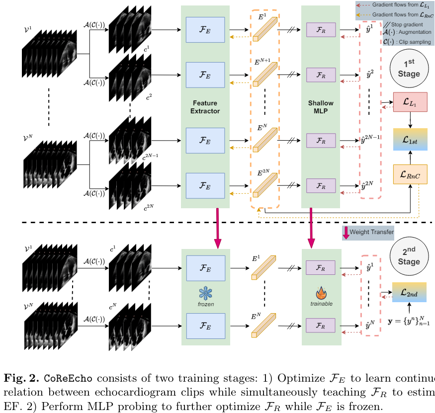
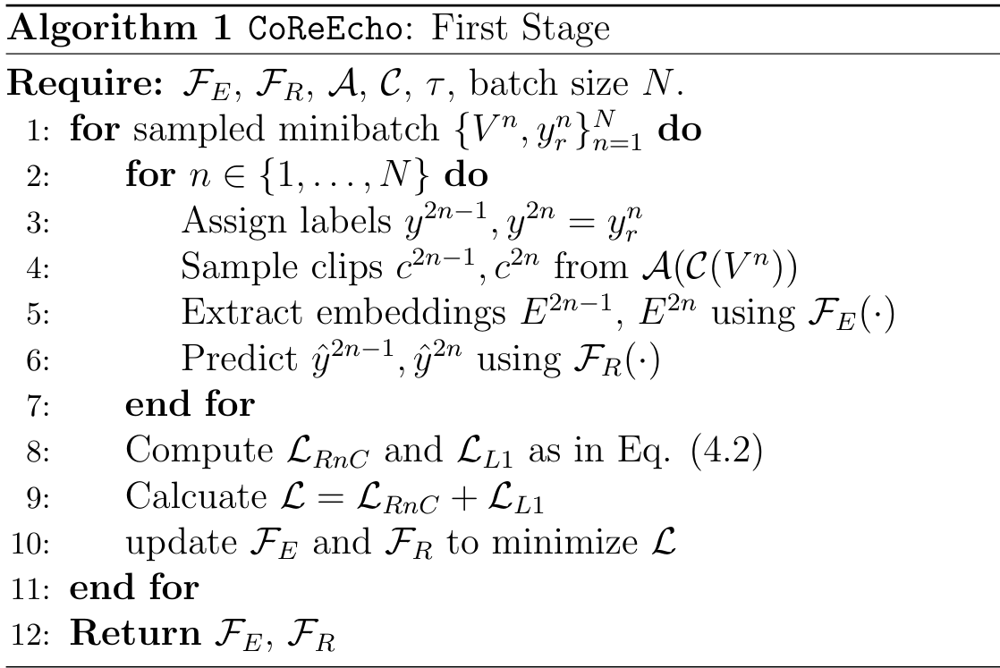
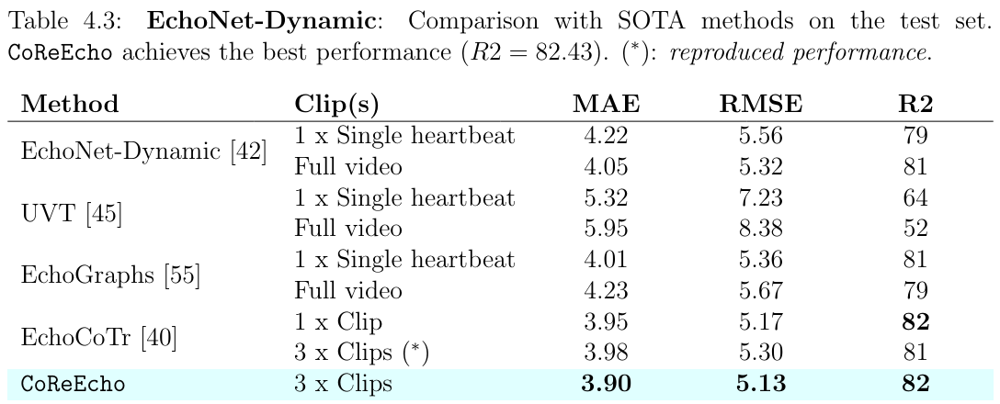
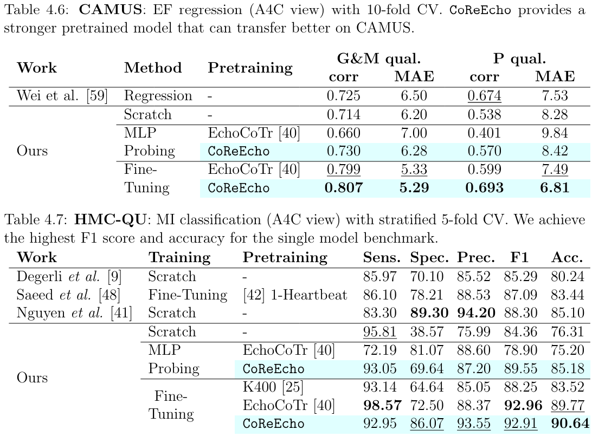
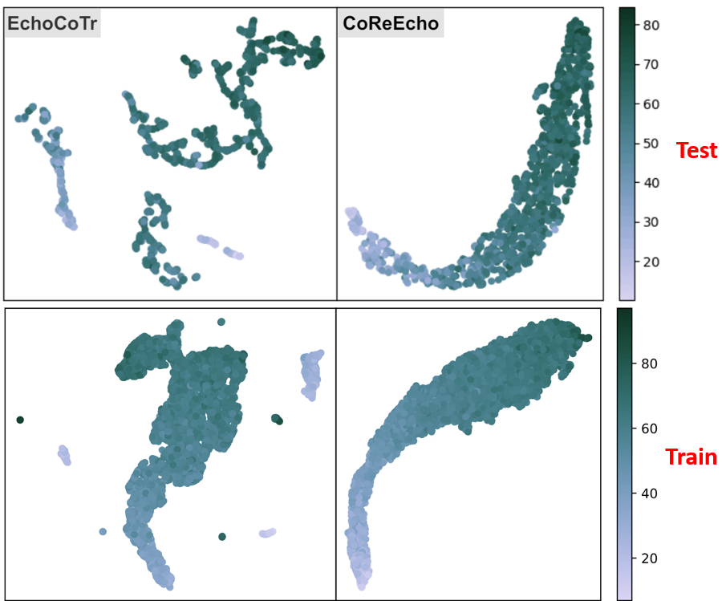
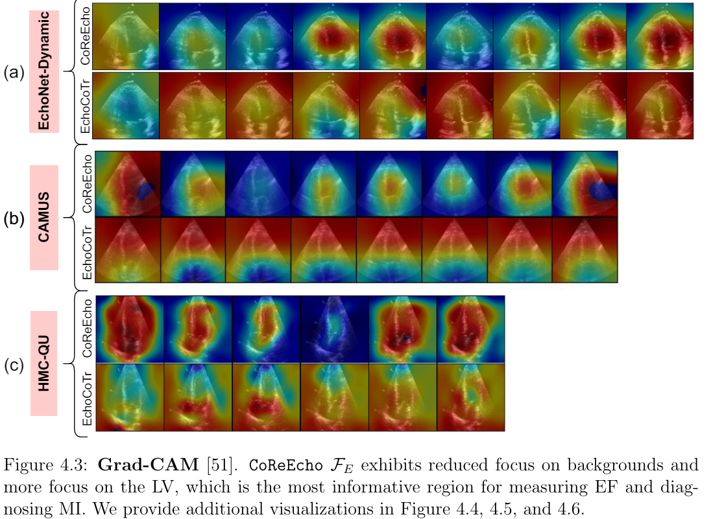

# CoReEcho: Continuous Representation Learning for 2D+time Echocardiography Analysis

[Fadillah Adamsyah Maani](https://scholar.google.com/citations?user=W-4975wAAAAJ&hl=en), [Numan Saeed](https://scholar.google.ae/citations?user=VMPEU20AAAAJ&hl=en), [Aleksandr Matsun](https://www.linkedin.com/in/sashamatsun/?originalSubdomain=ae) [Mohammad Yaqub](https://scholar.google.co.uk/citations?user=9dfn5GkAAAAJ&hl=en)

[](https://arxiv.org/abs/2403.10164)

Official implementation of the paper "CoReEcho".

## Highlights
### Abstract
> *Deep learning (DL) models have been advancing automatic medical image analysis on various modalities, including echocardiography, by offering a comprehensive end-to-end training pipeline. This approach enables DL models to regress ejection fraction (EF) directly from 2D+time echocardiograms, resulting in superior performance. However, the end-to-end training pipeline makes the learned representations less explainable. The representations may also fail to capture the continuous relation among echocardiogram clips, indicating the existence of spurious correlations, which can negatively affect the generalization. To mitigate this issue, we propose CoReEcho, a novel training framework emphasizing continuous representations tailored for direct EF regression. Our extensive experiments demonstrate that CoReEcho: 1) outperforms the current state-of-the-art (SOTA) on the largest echocardiography dataset (EchoNet-Dynamic) with MAE of 3.90 & R2 of 82.44, and 2) provides robust and generalizable features that transfer more effectively in related downstream tasks. The code is publicly available at https://github.com/BioMedIA-MBZUAI/CoReEcho.*
>

### Methodology





### Main Result





### Qualitative Results





## Run CoReEcho

To run this repository, you have to download the EchoNet-Dynamic original dataset.

### Installation
```bash
# Create a conda environment
conda create -n coreecho python=3.9

# Install the requirements
pip install -r requirements
```

### Training

The following is the bash script for the first training stage. Download the UniFormer-S pretrained weights [here](https://huggingface.co/Sense-X/uniformer_video/blob/main/uniformer_small_k400_16x8.pth).

```bash
python train_first_stage.py \
    --data_folder $echonet_dynamic_data_dir \
    --pretrained_weight $path_to_pretrained_uniformer_weights \
    --wandb \
    --wandb_project_name $wandb_project_name \
    --model uniformer_small \
    --num_workers 8 \
    --batch_size 16 \
    --frames 36 \
    --frequency 4 \
    --learning_rate 1e-4 \
    --weight_decay 1e-4 \
    --lr_decay_rate 0.1 \
    --temp 1.0 \
    --aug \
    --epochs 25 \
    --trial 0
```

The following is the bash script for the second training stage.

```bash
python train_second_stage.py \
    --data_folder $echonet_dynamic_data_dir \
    --pretrained_weights $path_to_best_ckpt_from_first_stage \
    --wandb \
    --wandb_project_name $wandb_project_name \
    --model uniformer_small \
    --num_workers 8 \
    --batch_size 16 \
    --frames 36 \
    --frequency 4 \
    --learning_rate 1e-4 \
    --weight_decay 1e-4 \
    --aug \
    --epochs 4 \
    --trial 0
```

### Testing

```bash
python test_with_three_clips.py \
    --data_folder $echonet_dynamic_data_dir \
    --pretrained_weights $path_to_ckpt \ # Can use a model from either 1st stage or 2nd stage
    --path_test_start_indexes $path_to_test_start_indexes \ # This path should refer to test_start_indexes.pkl
    --path_save_test_files $save_path \
    --model 'uniformer_small' \
    --frames 36 \
    --frequency 4 \
    --num_workers 4
```

## Pretrained Weights
| Model | Checkpoint |
|------------|----------|
| UniFormer-S | [link](https://drive.google.com/file/d/1ZNF4lMTLEnaZyhVHHTUW_MctB7kDGP6o/view?usp=sharing) |

## TODO

- [x] Release the transfer learning code
- [ ] Convert `environment.yml` to `requirements.txt` for faster installation

## Citation
If you find this repository useful, please consider citing this work:
```latex
@misc{maani2024coreecho,
      title={CoReEcho: Continuous Representation Learning for 2D+time Echocardiography Analysis}, 
      author={Fadillah Adamsyah Maani and Numan Saeed and Aleksandr Matsun and Mohammad Yaqub},
      year={2024},
      eprint={2403.10164},
      archivePrefix={arXiv},
      primaryClass={cs.CV}
}
```